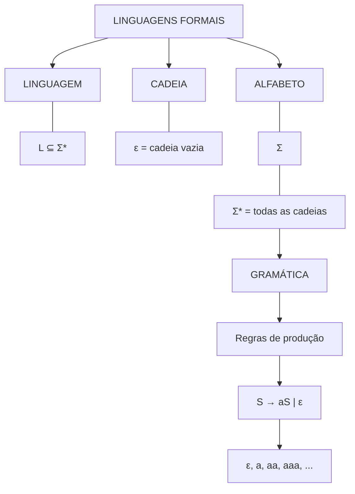

# Aula 02: Sumário, objetivos, conteúdo, exemplos, exercícios e revisão para prova.

## 📚 Aula 1 — Linguagens Formais e Gramáticas

> Introdução aos principais conceitos de Linguagens Formais, Alfabetos, Cadeias, Linguagens e Gramáticas.

📑 Sumário

## 🎯 Objetivos da Aula

Ao final desta aula, devemos ser capazes de:

* Entender o conceito de **alfabeto**;
* Identificar **cadeias/palavras**;
* Compreender a **palavra vazia** `ε`;
* Identificar **prefixos e sufixos**;
* Entender o conceito de **linguagem formal**;
* Interpretar a notação `L ⊆ Σ*`;
* Compreender o funcionamento de uma **gramática formal**;
* Interpretar **regras de produção**;
* Gerar palavras a partir de uma gramática.

## 1. Operadores Lógicos

Os principais operadores estudados são:

| Símbolo | Nome | Leitura |
| :---: | :--- | :--- |
| `¬` | Negação | não |
| `∧` | E | e |
| `∨` | OU | ou |
| `→` | Implicação | implica / se... então |

## Exemplo
Considere:

p = "Está chovendo."
q = "Eu levo um guarda-chuva."

Negação — ¬
¬p
Lê-se:

Não está chovendo.

E — ∧
p ∧ q
Lê-se:

Está chovendo e eu levo um guarda-chuva.

OU — ∨
p ∨ q
Lê-se:

Está chovendo ou eu levo um guarda-chuva.

Implicação — →
p → q
Lê-se:

Se está chovendo, então eu levo um guarda-chuva.

⚠️ Atenção: o símbolo → possui significados diferentes dependendo do contexto. Em lógica, significa implicação. Em gramáticas, normalmente significa produção/geração.

2. Palavra Vazia — ε
A palavra vazia é representada por:

ε
Lê-se:

Épsilon

Ela representa uma cadeia que não possui nenhum símbolo.

Seu tamanho é:

|ε| = 0
Ou seja:

O comprimento da cadeia vazia é zero.

Exemplo
A cadeia:

abc
possui 3 símbolos:

|abc| = 3
Já:

ε
possui 0 símbolos:

|ε| = 0
⚠️ Importante
ε não é um espaço em branco.

ε significa:

Não existe nenhum símbolo na cadeia.

3. Prefixos e Sufixos
Considere a palavra:

ab
Prefixos
Um prefixo é uma parte da palavra que começa no início.

Podemos obter:

ε
a
ab
Portanto:

Prefixos(ab) = {ε, a, ab}
🧠 Dica
Prefixo → começa no começo.

Sufixos
Um sufixo é uma parte da palavra que termina no final.

Podemos obter:

ε
b
ab
Portanto:

Sufixos(ab) = {ε, b, ab}
🧠 Dica
Sufixo → termina no final.

Resumo
Palavra	Prefixos	Sufixos
ab	ε, a, ab	ε, b, ab
O ε é considerado tanto prefixo quanto sufixo.

4. Alfabeto — Σ
Um alfabeto é um conjunto finito de símbolos.

Ele é representado por:

Σ
Lê-se:

Sigma

Exemplo
Σ = {a, b}
Nosso alfabeto possui dois símbolos:

a
b
A partir deles podemos criar palavras:

a
b
aa
ab
ba
bb
aaa
aab
aba
...
5. Σ* — Todas as Cadeias Possíveis
A notação:

Σ*
representa o conjunto de todas as cadeias finitas que podem ser formadas utilizando os símbolos de Σ, incluindo ε.

Se:

Σ = {a, b}
então:

Σ* = {ε, a, b, aa, ab, ba, bb, aaa, ...}
Existe um limite?
Não existe limite máximo para o tamanho das palavras.

Podemos formar:

ε
a
aa
aaa
aaaa
aaaaa
...
A quantidade de palavras cresce conforme o tamanho aumenta.

Para um alfabeto com 2 símbolos:

Quantidade de cadeias de tamanho n = 2ⁿ
Tamanho	Quantidade
0	1
1	2
2	4
3	8
4	16
5	32
...	...

# 📌 Conclusão
Σ* é infinito, mas cada cadeia individual possui tamanho finito.

6. Linguagem Formal — L
Uma linguagem formal é um conjunto de palavras construídas a partir de um alfabeto.

Sua definição é:

L ⊆ Σ*
Lê-se:

L é um subconjunto de Sigma estrela.

Entendendo cada elemento
Σ
É o alfabeto.

Σ*
É o conjunto de todas as palavras possíveis.

L
É um conjunto de palavras escolhidas de Σ*.

Exemplo
Considere:

Σ = {a, b}
Podemos definir:

L = {a, ab, abb, abbb}
Como todas essas palavras podem ser formadas usando a e b:

L ⊆ Σ*
Linguagem finita
L = {ε, a, ab}
Possui uma quantidade limitada de palavras.

Linguagem infinita
L = {a, aa, aaa, aaaa, ...}
Possui infinitas palavras.

7. Gramática Formal
Uma gramática formal fornece regras para gerar palavras.

Considere:

G = ({S}, {a}, {S → aS | ε}, S)
Uma gramática normalmente pode ser representada como:

G = (N, Σ, P, S)
Onde:

Elemento	Significado
N	Não terminais
Σ	Terminais
P	Produções
S	Símbolo inicial
No nosso exemplo:

G = ({S}, {a}, {S → aS | ε}, S)
Temos:

Não terminal
{S}
Terminal
{a}
Produções
S → aS | ε
Símbolo inicial
S
8. Regras de Produção
A regra:

S → aS | ε
possui duas possibilidades:

S → aS
OU

S → ε
O símbolo:

|
significa:

OU

Portanto:

S pode produzir aS ou ε.

9. Como Ler →
O símbolo:

→
pode ser lido de maneiras diferentes.

Em gramáticas
Pode significar:

produz;
gera;
deriva em.
Exemplo:

S → aS
Lê-se:

S produz aS.

Em lógica
Pode significar:

implica;
se... então.
Exemplo:

p → q
Lê-se:

Se p, então q.

ou:

p implica q.

10. Derivação de Palavras
Considere:

G = ({S}, {a}, {S → aS | ε}, S)
Começamos sempre pelo símbolo inicial:

S
Gerando ε
Escolhemos:

S → ε
Resultado:

ε
Gerando a
Primeiro:

S → aS
Depois:

S → ε
Logo:

S → aS → aε → a
Resultado:

a
Gerando aa
Aplicamos S → aS duas vezes:

S → aS
  → aaS
  → aaε
  → aa
Resultado:

aa
Gerando aaa
Aplicamos S → aS três vezes:

S → aS
  → aaS
  → aaaS
  → aaaε
  → aaa
Resultado:

aaa
11. Linguagem Gerada
A gramática:

G = ({S}, {a}, {S → aS | ε}, S)
gera:

ε
a
aa
aaa
aaaa
aaaaa
...
Logo:

L(G) = {ε, a, aa, aaa, aaaa, ...}
Também podemos representar como:

L(G) = {aⁿ | n ≥ 0}
Isso significa:

A linguagem contém qualquer quantidade de a, incluindo zero a.

O caso de zero a é:

ε
12. Atividades Práticas
📝 Atividade 1 — Prefixos e Sufixos
Considere a palavra:

ab
Pergunta
Liste os prefixos e sufixos.

Gabarito
Prefixos:

{ε, a, ab}
Sufixos:

{ε, b, ab}
📝 Atividade 2 — Gramática
Considere:

G = ({S}, {a}, {S → aS | ε}, S)
Pergunta
Liste 3 palavras geradas.

Gabarito
Uma resposta possível:

ε
a
aa
Outras possibilidades:

aaa
aaaa
aaaaa
...
13. Resumo para Prova
🔹 Alfabeto
Σ = conjunto de símbolos
Exemplo:

Σ = {a, b}
🔹 Cadeia
Uma sequência de símbolos pertencentes ao alfabeto.

Exemplo:

ab
🔹 Palavra vazia
ε
Possui zero símbolos:

|ε| = 0
🔹 Σ*
Todas as cadeias finitas possíveis sobre Σ, incluindo ε.

Σ* = {ε, a, b, aa, ab, ba, bb, ...}
🔹 Linguagem
Um conjunto de cadeias:

L ⊆ Σ*
🔹 Prefixo
Começa no início da palavra.

Para ab:

{ε, a, ab}
🔹 Sufixo
Termina no final da palavra.

Para ab:

{ε, b, ab}
🔹 Gramática
Define regras para gerar palavras.

Exemplo:

S → aS | ε
🔹 →
Em gramáticas:

produz / gera

Em lógica:

implica / se... então

🔹 |
Nas regras de produção:

OU

Exemplo:

S → aS | ε
Significa:

S produz aS ou ε.

# 14. 🧠 Mapa Mental

    

📚 Aula 1 concluída
Próximo passo: praticar a identificação de alfabetos, cadeias, prefixos, sufixos e a derivação de palavras por meio de gramáticas formais.
